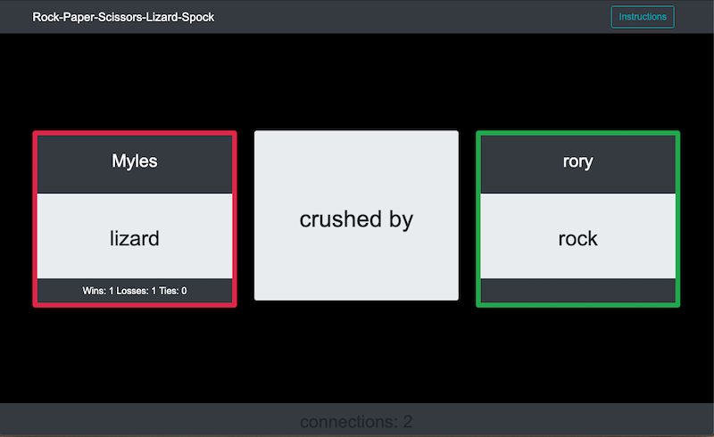

# Rock Paper Scissors Lizard Spock - Multiplayer game

RPSLK - Multiplayer

## Description
 
This game uses Firebase cloud storage database to help manage a two browser game
of Rock Paper Scissors Lizard Spock, a variation on the classic Rock-Paper-Scissors game. 

This page was created using HTML, CSS, Bootstrap, Javascript, JQuery and Firebase.

Waiting for players to connect:

Results revealed:

## Getting Started

### Dependencies

* none - responsive design usable on phone, table, laptop or desktop

### Installing

* none necessary - use two browser to play - players can be remote

### Executing program

* open in browser and follow instructions
*   1. enter player name
    2. wait for your opponent to sign on
    3. follow prompts/messages in central message box
    4. when your turn click button choice - rules below
        1. Rock  - crushes Lizard, crushes Scissors
        2. Paper - covers Rock, disproves Spock
        3. Scissors - cuts Paper, decapitates Lizard
        4. Lizard - poisons Spock, eats Paper
        5. Spock - smashes Scissors, vaporizes Rock
    5. click Instructions button in header bar for modal with instuctions    

    

## Help

For further development details see [UseCases and Psuedo Code](UseCases-PsuedoCode.md)

## Authors

Myles Carey 
mylescarey2019@gmail.com 

## Version History
 
* 0.1
    * Initial Release

## License

## Acknowledgments

Thanks to beta testers - my 15yo & 17yo daughters and wife 
