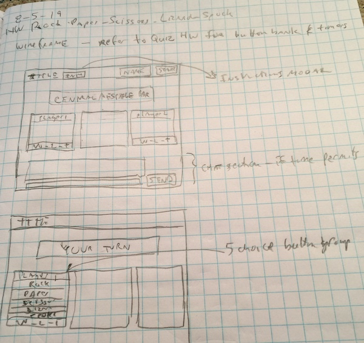

# Rock Paper Scissors Lizard Spock - Multplayer game

RPSLK - Multiplayer

## Description

This game uses Firebase cloud storage database to help manage a two browser game
of Rock Paper Scissors Lizard Spock, a variation on the classic Rock-Paper-Scissors game. 

## Requirement Note

Intend to leverage Bootstrap due to need for more practice and desire to make responsive.
User Firebase for player move information/communications between players browsers.
Timer usage for delay after showing result.

## User Stories / Use Cases

0.  This was the intended Use Case and program flow - final result was close to this
    although some differences to evolve during development.  See javascript code header
    for more details.

1.  page loads for the user
    1. Header bar has title name entry box with "name" as placeholder and start button
    2. Body has three boxes, left is for player 1, right is for player 2, middle is for results
    3. left and right boxes show 'waiting for your opponent', 'waiting for your opponent'

2.  user enters name presses start
    1. if no name entered do not accept start click 
    2. entry box / start button are hidden and greeting Hello player name shown in central message banner
    3. left box shows header with player name 
    4. left box shows footer with win/loss count

3.  second user enters name and presses start
    1. if no name entered do not accept start click
    2. entry box / start button are hidden and greeting Hello player name is shown in central message banner
    3. right box now shows the second players information on both sessions
    
4.  both players signed in 
    1. first player sees - "it is your turn" in central message banner
    2. second player sees - "waiting for player 1 name to choose in central message banner
    3. player one sees button group in their box - with Rock, Paper, Scissors, Lizard, Spock

5.  player one chooses a button
    1. button group clears
    2. message changes on player one to read 'waiting for player 2 name to choose' in central message banner

6.  player two 
    1. sees button group and message it is your turn
    2. chooses a button

7.  results computed
    0. central message banner is cleared
    1. player one box shows choice
    2. player two box shows choice
    3. middle result box says player name that won or tie
    4. win-loss-tie counts are updated on left and right boxes
    5. timer starts and runs for 2-3 seconds
    6. repeat steps 4 thru 7 

8.  player closes browswer
    1. detect windows close event
    2. alter other player game over player name has left - show message in central message banner

### Psuedo Code - notes

1. Global
    1. Variables
        1. game state
        2. player one wins
        3. player two wins
        4. ties
        5. Firebase key/values
            1. player one name
            2. player two name
            3. player one choice
            4. player two choice

    2. Functions
        1. TBD

2. Objects/Classes
    1. userInterface (static object)
        1. Properties
            1. TBD
        2. Methods
            1. hide entry box/start button
            2. update player header
            3. update player footer
            4. show / hide player button bank
            5. show / hide player message box content
            2. update cental message banner 

    2. manageFirebase (static object)
        1. Properties
            1. TBD
        2. Methods
            1. set term
            2. clear term

3. Events/Listeners/Timers
    1. on click for start button
    2. on click for button bank
    3. timer for result reveal read time  
    4. event for window close       
